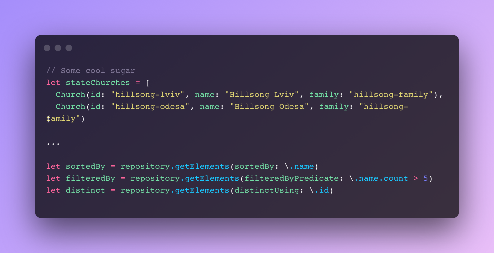

<p align="center">
<br>

<br/>
<a></a>
<a></a>
</p>

**XRepository** is based on [QBRepository by QuickBirds Studios](https://github.com/quickbirdstudios/QBRepository). It is lightweight implementation of Repository pattern in Swift.

##  Getting started
Cornerstones of this project are `protocol Repository` and `class AnyRepository` as its generic implementation. `Repository` supports basic and advanced CRUD operations. Also, you have access to out-of-the-box implementations of a few popular storages based on: `BehaviorRelay`, `RealmSwift`, `FileManager`. But you can also create your own implementation of those ones or any other storage mechanism.

<p align="center">
  
</p>

## Usage
Since `Repository` requires associated value to it, we use its abstract implementation `AnyRepository`.
Usage is simple:

<p align="center">
  
</p>

And some cool sugar
<p align="center">
  
</p>

##  RxSwift
**XRepository** is a pure implementation of Repository pattern. If you want to add RxSwift support to your repository, check super-lightweight extension: [RxXRepository](https://github.com/sashkopotapov/RxXRepository.git)

## Instalation
### Swift Package Manager

The [Swift Package Manager](https://swift.org/package-manager/) is a tool for automating the distribution of Swift code and is integrated into the `swift` compiler. It is in early development, but Alamofire does support its use on supported platforms.

Once you have your Swift package set up, adding Alamofire as a dependency is as easy as adding it to the `dependencies` value of your `Package.swift`.

```swift
dependencies: [
    .package(url: "https://github.com/sashkopotapov/XRepository.git", .upToNextMinor(from: "1.2.0"))
]
```

## 👤 Author
This framework is created by Sashko Potapov.

## 📃 License

XCoordinator is released under an MIT license. See [License.md](https://github.com/sashkopotapov/XRepository/blob/main/LICENSE) for more information.
